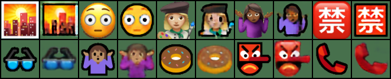

# CycleGAN_emoji
Swap Apple-Windows styles emojis using CycleGAN

This is based on [an assignment of CSC321-Winter-2018, University of Toronto](http://www.cs.toronto.edu/~rgrosse/courses/csc321_2018/assignments/a4-handout.pdf).

# The task

> In this assignment, you’ll get hands-on experience coding and training GANs. This assignment is
divided into two parts: in the first part, we will implement a specific type of GAN designed to
process images, called a Deep Convolutional GAN (DCGAN). We’ll train the DCGAN to generate
emojis from samples of random noise. In the second part, we will implement a more complex
GAN architecture called CycleGAN, which was designed for the task of image-to-image translation
(described in more detail in Part 2). We’ll train the CycleGAN to convert between Apple-style and
Windows-style emojis.

# Dependencies

+ PyTorch (developed in 1.11.0)
+ torchvision (developed in 0.12.0)

# Inventory

+ `config.py`: configuration settings for training.
+ `model.py`: model definitions.
+ `loader.py`: data loader.
+ `train.py`: training script.
+ `test.py`: perform inference using trained model.

# Results

The following are some random inference results on the test dataset, using pre-trained weights
trained after 100 epochs.

The first row contains Apple-to-Windows style-transferred emojis, and the 2nd row the reverse
transfers.

